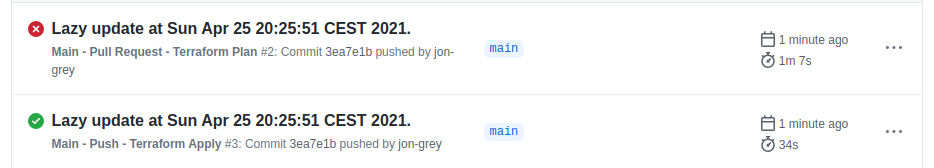
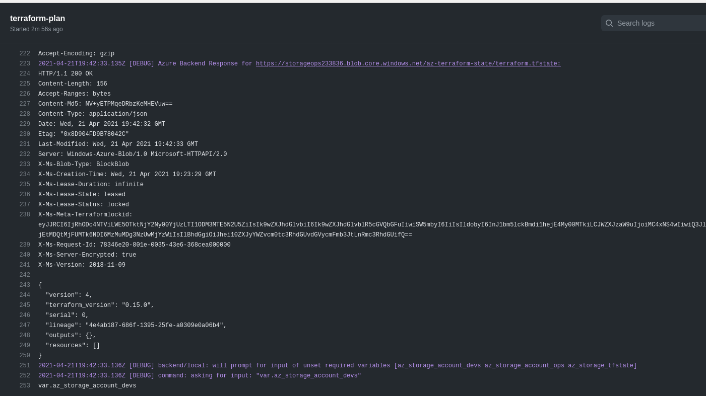
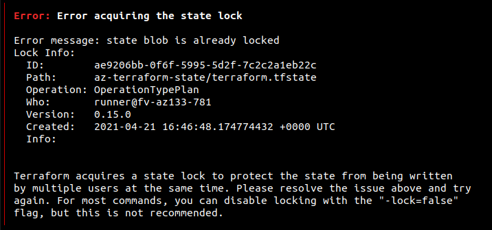
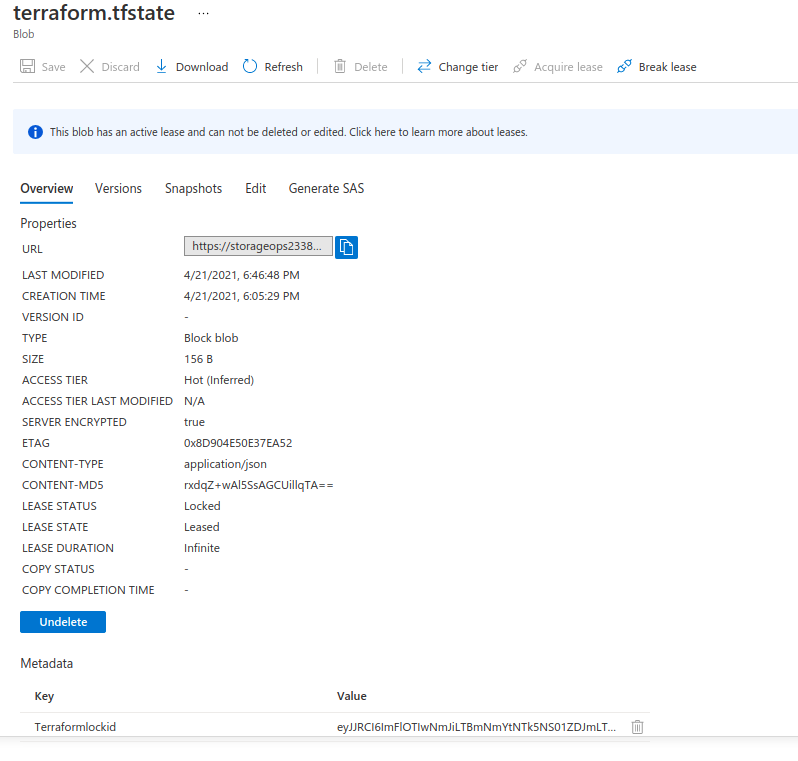
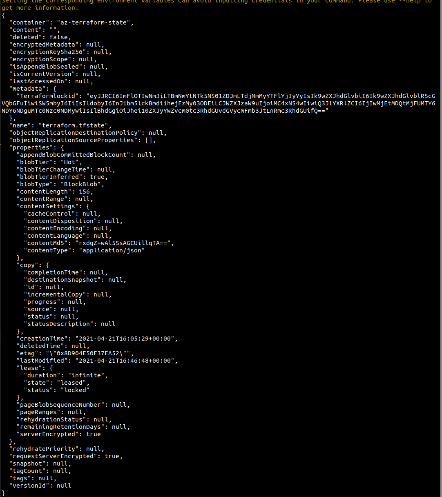

# TODO

## AKS

### Networking

- [x] setup AKS based on VMs with kubenet
- [ ] setup AKS based on VMs and ACI with VNet to replace kubenet

### Access

- [x] RBAC service principal with cliend id and secret
- [x] user assigned managed identity
  - [x] - widely priviliged role of "Contributor"
  - [ ] - restrict priviliges for higher security

## Terraform

- [x] isolate terraform states:
  - [x] sharing one azure storage account with other github projects, 
  - [x] using different blobs to hold terraform states for different deployments

## Multistage environments

- [x] multistage namespaces:
  - [Using Helm to Deploy a Kubernetes Application to Multiple Environments (QA/Stage/Prod) - Codefresh](https://codefresh.io/helm-tutorial/helm-deployment-environments/) 
  - [codefresh-contrib/helm-promotion-sample-app](https://github.com/codefresh-contrib/helm-promotion-sample-app/blob/master/chart/values-qa.yaml) 
  - [codefresh-contrib/helm-promotion-sample-app](https://github.com/codefresh-contrib/helm-promotion-sample-app/blob/master/chart/values-staging.yaml)
- [ ] multistage clusters to replace multistage namespaces

NEW ISSUE

```s
                ||     ||
Acquiring state lock. This may take a few moments...
azurerm_resource_group.devs: Refreshing state... [id=/subscriptions/53cda94b-af20-45ab-82c0-04e260445517/resourceGroups/resource-group-demo-devs]
module.a_aks_cluster.tls_private_key.aks-key: Creating...
module.a_aks_cluster.tls_private_key.aks-key: Creation complete after 0s [id=2fd80cab03979e1e107e2fe82b7c98d14dea3462]
module.a_aks_cluster.null_resource.aks-save-key: Creating...
module.a_aks_cluster.null_resource.aks-save-key: Provisioning with 'local-exec'...
module.a_aks_cluster.null_resource.aks-save-key (local-exec): (output suppressed due to sensitive value in config)
module.a_aks_cluster.null_resource.aks-save-key: Creation complete after 0s [id=2920825437605981912]
azurerm_resource_group.devs: Destroying... [id=/subscriptions/53cda94b-af20-45ab-82c0-04e260445517/resourceGroups/resource-group-demo-devs]
azurerm_resource_group.aks: Creating...
module.a_acr.azurerm_container_registry.acr: Creating...
module.a_aks_cluster.azurerm_kubernetes_cluster.aks: Creating...
azurerm_resource_group.devs: Still destroying... [id=/subscriptions/53cda94b-af20-45ab-82c0-...esourceGroups/resource-group-demo-devs, 10s elapsed]
azurerm_resource_group.devs: Still destroying... [id=/subscriptions/53cda94b-af20-45ab-82c0-...esourceGroups/resource-group-demo-devs, 20s elapsed]
azurerm_resource_group.devs: Still destroying... [id=/subscriptions/53cda94b-af20-45ab-82c0-...esourceGroups/resource-group-demo-devs, 30s elapsed]
azurerm_resource_group.devs: Still destroying... [id=/subscriptions/53cda94b-af20-45ab-82c0-...esourceGroups/resource-group-demo-devs, 40s elapsed]
```

# Deployment steps

> Note: terraform for azure will not work before doing `make setup-deployments; make submit-deployments` or simply `make all`. As such github actions will fail as they need secrets!

## Setup deployments

In here we create Azure RBAC, install terraform locally, setup resources in Azure for Terraform. 

```sh
make setup-deployments
```

## Submit Deployments

In here we update dynamic variables for terraform via bash (edit deployments-submit/02.make.terraform.tfvars.sh accordingly), test our terraform deployment locally, and push changes of repo to github.

```sh
make submit-deployments
```

In github 


# Best Practices

## Terraform


### Workspaces

```sh
export WORKSPACES=( "devs" "prod" "stag" "test" )
for wsp in ${WORKSPACES[@]}; do
    terraform workspace new $wsp || true
done

terraform workspace select ${WORKSPACES[0]}
```

and separate tfstate file to avoid deadlocks

```sh
for wsp in ${WORKSPACES[@]}; do
echo "
terraform {
  backend ${DQT}azurerm${DQT} {
    resource_group_name  = ${DQT}${AZURE_RESOURCE_GROUP_OPS}${DQT}
    storage_account_name = ${DQT}${AZURE_STORAGE_ACCOUNT_OPS}${DQT}
    container_name       = ${DQT}${wsp}-${AZURE_STORAGE_BLOB_TFSTATE_LOCAL_AKS}${DQT}
    key                  = ${DQT}${wsp}-terraform.tfstate${DQT}
  }
}

" > "../deployments/terraform/azure-aks/workspaces/${wsp}/provider.tf"
```

access with

```js
env="${terraform.workspace}"
```

with dirs layout

```s
workspaces/
 |
 |-prod/
     |
     |-main.tf (has one backend setting; references a module in ../shared)
 |-dev/
     |
     |-main.tf (has a different backend setting; references a module in ../shared)
 |-shared/
     | 
     |- main.tf (etc.)

```
### Locals based on workspaces

[Terraform workspaces and locals for environment separation](https://medium.com/@diogok/terraform-workspaces-and-locals-for-environment-separation-a5b88dd516f5)

```js
provider "aws" {
  region= "us-east-1"
}
locals {
  env="${terraform.workspace}"
  counts = {
    "default"=1
    "production"=3
  }
  instances = {
    "default"="t2.micro"
    "production"="t4.large"
  }
  instance_type="${lookup(local.instances,local.env)}"
  count="${lookup(local.counts,local.env)}"
}
resource "aws_instance" "my_service" {
  ami="ami-7b4d7900"
  instance_type="${local.instance_type}"
  count="${local.count}"
}
```

# Issues

## Parallel access to same azure blob 

Each github workflow using storage blob should have its own blob as they try to lock the same blob



## Manually unlock terraform.tfstate blob in azure

```sh
isLocked=$(az storage blob show --name "terraform.tfstate"  --container-name az-terraform-state --account-name storageops233836 --query "properties.lease.status=='locked'" -o tsv)
 
if  $isLocked; then 
    az storage blob lease break --blob-name "terraform.tfstate" --container-name az-terraform-state --account-name storageops233836                
fi      
```


## terraform plan hangs in github actions



As we can here `command: asking for input: "var.az_storage_account_devs"` there are no variables, so we have to unignore `terraform.tfvars` file. LOL

## terraform plan is locked

When we try `terraform plan`



and in azure portal we see



or in az cli we can do

```sh
az storage blob show --name "terraform.tfstate" --container-name ${AZURE_STORAGE_TFSTATE} --account-name ${AZURE_STORAGE_ACCOUNT_OPS}  
```

to see 



Then we can break lease of blob in azure

```sh
az storage blob show --name "terraform.tfstate" --container-name ${AZURE_STORAGE_TFSTATE} --account-name ${AZURE_STORAGE_ACCOUNT_OPS}
```